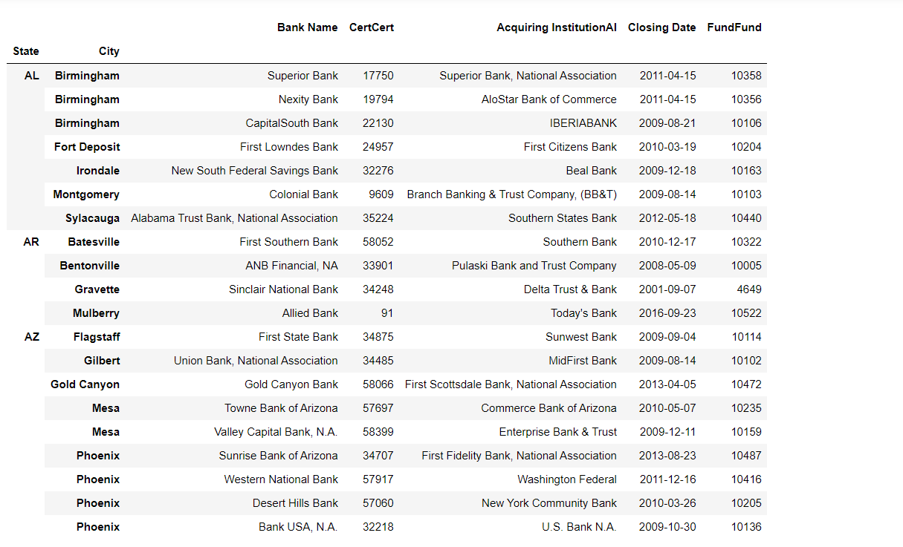
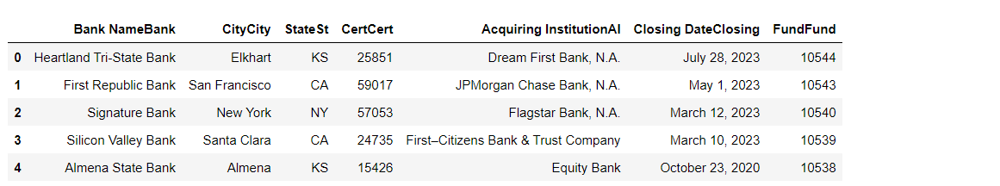

# Failed-Bank-list-Data-Analyzer-USA-Government-Project

This project Conducts data analysis of FDIC's Failed Bank List, identifying trends, and predicting bank failures.It has Ability to work with complex datasets, perform in-depth analyses, and communicate findings effectively to inform decision-making processes.This project allowed to apply data analysis and modeling techniques to a critical area of the financial sector, providing valuable insights into bank failures, their causes, and their effects.

## For this:

Install the **requirement.txt** file from the repo **Failed-Bank-list-Data-Analyzer-USA-Government-Project** Then the python script as  [code.py](https://github.com/shashangka-upadhyaya/Failed-Bank-list-Data-Analyzer-USA-Government-Project/blob/main/code.py) gives the real insight of **Data-Analyzer-USA-Government-Project**. I had **train** the dataset from **FDIC** i.e [FDIC failed bank list  Dataset](https://www.fdic.gov/resources/resolutions/bank-failures/failed-bank-list/)

### Results
**1. Reorganizing the table to make the State and City as the indexes of the table. Displaying the first 20 rows of the new table :**

**2. in depth analysis is done from this data set from fdic us governmenet [here](https://www.fdic.gov/resources/resolutions/bank-failures/failed-bank-list/)**

